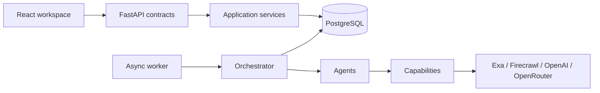
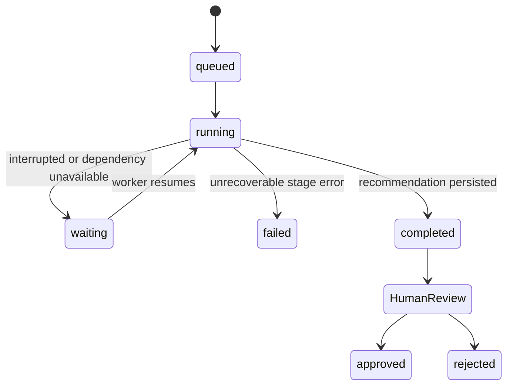

# SourcePilot architecture

## Boundaries

SourcePilot is a monorepo with an async FastAPI API, a separately runnable worker, a
React workspace, and PostgreSQL. HTTP routes validate contracts and call application
services. Services and the orchestrator use repositories or SQLAlchemy sessions;
agents neither manipulate database tables nor import vendor SDK contracts.

## Workflow and persistence

Creating a procurement request commits both the request and a workflow with four
dependency-linked tasks. The API returns immediately. The worker claims independent
queued workflows up to `MAX_CONCURRENT_WORKFLOWS`. Each completed stage commits its
task output and execution events, establishing a safe resume boundary.

The durable model includes procurement requests, workflows, workflow tasks, suppliers,
products, evidence, recommendations, and execution events. Alembic owns schema changes.
No meaningful workflow state depends only on process memory.

## Agent responsibilities

- **Orchestrator:** state transitions, dependency eligibility, task scheduling, durable
  events, and recovery boundaries.
- **Research Agent:** iterative queries, source discovery, and conservative structured
  extraction from untrusted page content.
- **Verification Agent:** concurrent cross-checking, first-party preference, and an
  explicit verified/extracted/unavailable status.
- **Evaluation Agent:** deterministic quantity, total, qualification, and ordering.
- **Recommendation Agent:** a concise shortlist with trade-offs and evidence references.

The current recommendation synthesis is deliberately deterministic. LLMs are used for
semi-structured extraction, where interpretation is useful; they are not used for
arithmetic, status transitions, filtering, or approval.

Organization name, delivery location, country, comparison currency, primary procurement
region, and permitted sourcing regions are runtime configuration. New requests persist a
snapshot of the relevant procurement context, and the research agent includes that context
in discovery and extraction. The shipped demo uses IT Essentials (ITE) in Sharjah, AED,
the UAE, and the wider GCC; none of those values limits the architecture to that geography.

## Capabilities and providers

Agents depend on `WebSearchCapability` and `LLMProvider` protocols. Exa and Firecrawl
responses become `SearchDocument` objects. OpenAI and OpenRouter implement the same
generation and structured-output interface. Switching is an environment change, not
an agent-code change.

The capability executor owns the cross-cutting policy: semaphore-based concurrency,
request timeout, exponential backoff, bounded retry, per-run caching, and sanitized
execution receipts. Provider credentials, private prompts, and hidden model reasoning
are not written to events or logs.

## Evidence and trust

External content is data, never instruction. Extraction prompts label it untrusted,
schemas reject malformed output, and evidence URLs cannot target local or non-public IP
addresses. Missing values stay null. Important product claims retain source URL,
retrieval time, source class, structured value, and verification status.

Verification work is gathered with partial-failure semantics. A blocked or unavailable
supplier does not erase successful supplier evidence and does not fail independent
work. Evaluation only qualifies offers that meet the configured verification, price,
and quantity constraints.

## Human authority

The workflow ends at `ready`. Approve and reject are audited recommendation state
transitions. No adapter or agent has an order-placement capability. A future purchasing
agent would be added after this boundary and would require a verified approval token or
equivalent policy object.

## Known first-milestone limits

- The database is the queue. The worker seam permits later adoption of a dedicated
  broker without changing domain records.
- Research caching is per orchestrator run rather than cross-workflow.
- Currency conversion is intentionally absent; offers outside the request's configured
  currency remain visible as evidence but cannot qualify for deterministic ranking.
- Supplier contact enrichment and procurement-policy administration are future slices.
